# ETKİNLİK BİLET SİSTEMİ PROJE DOKÜMANTASYONU

**DERS:** YAZILIM GEREKSİNİMLERİ VE ANALİZİ

**PROJE ADI:** Web Tabanlı Etkinlik Bilet Sistemi

**HAZIRLAYAN:** AHMET AKASLAN

**TARİH:** 12.06.2025

**CANLI DEMO:** [https://biletsistemi.ahmetakaslan.com/](https://biletsistemi.ahmetakaslan.com/)

**PROJE TANITIM VİDEOSU:**

*
<strong>Videoyu izlemek için yukarıdaki görsele tıklayınız.</strong>
*

---

## 1. BÖLÜM – TANITIM

### 1.1. Proje Amacı, Sorun ve Hedef Analizi

**Sorun Analizi (Problem Tanımı):**
Günümüzde etkinliklere katılım ve biletleme süreçleri, hem kullanıcılar hem de organizatörler için bazı temel sorunlar barındırmaktadır. Geleneksel yöntemler (fiziksel gişeler) veya eski nesil web siteleri, genellikle verimsiz, coğrafi olarak kısıtlayıcı ve kullanıcı deneyimi açısından zayıftır. Kullanıcılar, kendi çevrelerindeki yerel etkinliklerden haberdar olmakta zorlanır ve bilet satın alma süreçleri karmaşık olabilir. Bu durum, potansiyel katılımcıların etkinlikleri kaçırmasına ve organizatörlerin hedef kitlelerine ulaşamamasına neden olur.

**Projenin Amacı:**
Bu projenin temel amacı, yukarıda belirtilen sorunlara çözüm olarak; kullanıcıların etkinlikleri kolayca keşfetmelerini, bilet satın almalarını ve katılımlarını dijital olarak yönetmelerini sağlayan modern, merkezi ve kullanıcı dostu bir web tabanlı platform oluşturmaktır.

**Hedef Analizi (Proje Hedefleri):**
- **Kullanıcılar için:** Coğrafi konum bazlı öneriler sunarak yerel etkinlikleri keşfetmeyi kolaylaştırmak, güvenli ve hızlı bir bilet satın alma deneyimi sunmak, satın alınan biletlere QR kod ile dijital olarak kolay erişim sağlamak.
- **Yöneticiler için:** Etkinliklerini (oluşturma, düzenleme, silme) verimli bir şekilde yönetebilecekleri, bilet satışlarını takip edebilecekleri ve bilet doğrulama işlemlerini sorunsuzca yapabilecekleri bir yönetim paneli sunmak.
- **Sistem için:** Güvenilir, performanslı, güvenli ve bakımı kolay bir altyapı oluşturmak.

### 1.2. Projenin Kapsamı
Proje, aşağıdaki ana modülleri ve işlevleri kapsamaktadır:
-   **Kullanıcı Yönetimi:** Kullanıcıların sisteme kaydolması, giriş yapması ve profil bilgilerini yönetmesi.
-   **Etkinlik Yönetimi:** Yöneticilerin yeni etkinlikler oluşturması, mevcut etkinlikleri düzenlemesi ve silmesi. Etkinlikler; başlık, açıklama, tarih, konum, fiyat ve kontenjan gibi detayları içerir.
-   **Bilet Satın Alma:** Kullanıcıların listelenen etkinlikler için bilet satın alması.
-   **Bilet Görüntüleme ve QR Kod:** Satın alınan biletlerin kullanıcı hesabında listelenmesi ve her bilet için benzersiz bir QR kod oluşturulması.
-   **Bilet Doğrulama:** Etkinlik girişinde, görevlilerin kullanıcıların QR kodlarını okutarak biletin geçerliliğini kontrol etmesi.
-   **Konum Tabanlı Öneriler:** Kullanıcıların coğrafi konumlarına göre yakınlarındaki etkinlikleri görmesi.
-   **Destek Sistemi:** Kullanıcıların sorun veya taleplerini iletebilecekleri bir destek talep sistemi.

Proje, PHP ve MySQL kullanılarak geliştirilmiş olup, standart bir paylaşımlı hosting ortamında çalışacak şekilde tasarlanmıştır.

---

## 2. BÖLÜM – PLANLAMA

Bu proje tek bir geliştirici tarafından hayata geçirildiği için planlama, fazlara ayrılmış bir kişisel çalışma takvimi olarak düşünülmüştür.

### 2.1. Gantt Şeması
Proje geliştirme süreci aşağıdaki Gantt şeması ile görselleştirilmiştir.

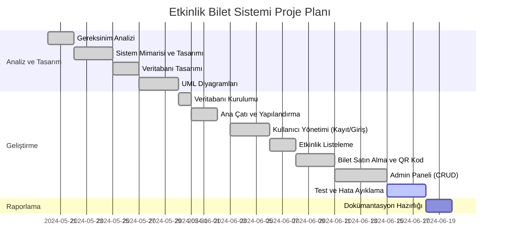

### 2.2. Ekip Yapısı ve Zaman Planı
-   **Ekip:** 1 Geliştirici.
-   **Sorumluluklar:** Analiz, tasarım, geliştirme, test ve dokümantasyon işlemlerinin tamamı tek bir kişi tarafından yürütülmüştür.
-   **Zaman Planı:** Yukarıdaki Gantt şemasında belirtilen iş-zaman planına sadık kalınarak proje ilerletilmiştir.

---

## 3. BÖLÜM – ÇÖZÜMLEME (ANALİZ)

### 3.1. Mevcut Sistem Analizi
Geleneksel etkinlik biletleme süreçleri genellikle fiziksel gişeler, telefonla rezervasyon veya basit online formlar üzerinden yürümektedir. Bu yöntemlerin eksiklikleri şunlardır:
-   **Coğrafi Kısıtlamalar:** Kullanıcılar sadece bildikleri veya yakınlarındaki gişelerden bilet alabilirler.
-   **Verimsizlik:** Biletlerin basılması, saklanması ve kontrol edilmesi maliyetli ve zaman alıcıdır.
-   **Anlık Bilgi Eksikliği:** Kalan bilet sayısı, etkinlik doluluk oranı gibi anlık bilgilere ulaşmak zordur.
-   **Kullanıcı Deneyimi:** Yakındaki etkinlikleri keşfetme imkanı sunmazlar.

### 3.2. Önerilen Sistemin Çözümleri
Geliştirilen "Etkinlik Bilet Sistemi", mevcut sistemlerin eksikliklerine şu çözümleri sunar:
-   **Merkezi Platform:** Tüm etkinlikleri ve biletleri tek bir dijital platformda birleştirir.
-   **Dijital Biletleme:** Fiziksel bilet ihtiyacını ortadan kaldırarak maliyetleri düşürür ve süreci hızlandırır. Biletler, QR kod ile güvenli ve kolay bir şekilde doğrulanır.
-   **Konum Tabanlı Keşif:** Kullanıcıların mobil cihazlarından veya tarayıcılarından alınan konum bilgisiyle yakınlarındaki etkinlikleri öncelikli olarak gösterir, böylece yerel etkinliklerin keşfedilmesini sağlar.
-   **Gerçek Zamanlı Veri:** Kullanıcılar ve yöneticiler, etkinliklerin doluluk oranları ve satış istatistikleri gibi verilere anlık olarak erişebilir.

### 3.3. Detaylı İhtiyaç Belirtimi

#### 3.3.1. Fonksiyonel Gereksinimler
-   **FG-1: Kullanıcı Yönetimi:** Sistem, yeni kullanıcıların bir kullanıcı adı, e-posta ve şifre ile kaydolmasına, giriş ve çıkış yapmasına izin vermelidir.
-   **FG-2: Etkinlik Listeleme:** Sistem, yaklaşan tüm etkinlikleri ana sayfada listelemeli ve kullanıcıların etkinlik detaylarını görmesini sağlamalıdır.
-   **FG-3: Bilet Satın Alma:** Giriş yapmış kullanıcılar, kontenjanı dolu olmayan etkinlikler için bilet satın alabilmelidir.
-   **FG-4: Bilet Görüntüleme ve QR Kod:** Kullanıcılar, satın aldıkları tüm biletleri hesaplarında QR kodu ile birlikte görebilmelidir.
-   **FG-5: Konum Tabanlı Öneriler:** Kullanıcı konum izni verdiğinde, sistem kullanıcının yakınındaki (örn: 5km) etkinlikleri listelemelidir.
-   **FG-6: Yönetici Etkinlik Yönetimi (CRUD):** Yöneticiler, yönetim panelinden yeni etkinlik ekleyebilmeli, mevcutları güncelleyebilmeli ve silebilmelidir.
-   **FG-7: Bilet Doğrulama:** Yöneticiler veya görevliler, bir biletin QR kodunu okutarak geçerliliğini (kullanılmış/kullanılmamış) anında kontrol edebilmelidir.
-   **FG-8: Destek Sistemi:** Kullanıcılar, sistemle ilgili sorun veya taleplerini iletebilecekleri bir destek talebi oluşturabilmelidir.

#### 3.3.2. Fonksiyonel Olmayan Gereksinimler
-   **FOG-1: Performans:** Sayfa yükleme süreleri 3 saniyenin altında olmalıdır. Yoğun yük altında bile sistemin yanıt süresi makul seviyede kalmalıdır.
-   **FOG-2: Güvenlik:** Tüm kullanıcı şifreleri veritabanında geri döndürülemez şekilde şifrelenerek (hash) saklanmalıdır. Sistem, SQL enjeksiyonu ve XSS gibi yaygın web zafiyetlerine karşı korunmalıdır.
-   **FOG-3: Kullanılabilirlik:** Arayüz, modern, sezgisel ve farklı ekran boyutlarına (mobil, tablet, masaüstü) uyumlu (responsive) olmalıdır.
-   **FOG-4: Uyumluluk:** Web uygulaması, modern web tarayıcılarının (Chrome, Firefox, Safari, Edge) güncel sürümlerinde tutarlı bir şekilde çalışmalıdır.
-   **FOG-5: Bakım Kolaylığı:** Kod, okunabilir, modüler ve anlaşılır olmalıdır. Kritik bölümler için açıklayıcı yorum satırları içermelidir.
-   **FOG-6: Güvenilirlik:** Sistemin erişilebilirliği yüksek (örn: %99 uptime) olmalıdır. Veritabanı veya sunucu hataları, kullanıcıya teknik detayları ifşa etmeden yönetilmelidir.

### 3.4. User Story'ler
-   **US-1 (Kullanıcı Olarak):** Yakınımdaki konserleri ve tiyatroları kolayca bulabilmek istiyorum, böylece yeni etkinlikler keşfedebilirim.
-   **US-2 (Kullanıcı Olarak):** Beğendiğim bir etkinliğe hızlıca online bilet alabilmek istiyorum, böylece gişede sıra beklemek zorunda kalmam.
-   **US-3 (Kullanıcı Olarak):** Satın aldığım biletlerimi telefonumda QR kod olarak görmek istiyorum, böylece etkinliğe kağıt bilet olmadan kolayca giriş yapabilirim.
-   **US-4 (Etkinlik Yöneticisi Olarak):** Yönetim panelinden kolayca yeni bir etkinlik oluşturup yayınlayabilmek istiyorum, böylece bilet satışlarına hemen başlayabilirim.
-   **US-5 (Etkinlik Görevlisi Olarak):** Etkinlik girişinde bir katılımcının biletinin geçerli olup olmadığını QR kodunu okutarak saniyeler içinde anlamak istiyorum, böylece girişlerdeki yığılmayı önleyebilirim.

### 3.5. Önerilen Sistemin İşlevsel Modeli (Use Case)

#### 3.5.1. Use Case Diyagramı

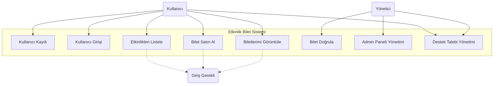

#### 3.5.2. Use Case Senaryoları

**Use Case 1: Bilet Satın Al**
| **Alan** | **Açıklama** |
| --- | --- |
| **Use Case Adı** | Bilet Satın Al |
| **Aktörler** | Kullanıcı |
| **Ön Koşul** | Kullanıcı sisteme giriş yapmış olmalıdır. |
| **Akış** | 1. Kullanıcı, ana sayfadan veya etkinlikler listesinden bir etkinlik seçer.   2. Etkinlik detay sayfasını görüntüler.   3. "Bilet Al" butonuna tıklar.   4. Sistem, kullanıcının bakiye/ödeme bilgilerini kontrol eder (Bu projede simüle edilmiştir).   5. Sistem, etkinliğin kontenjanını kontrol eder.   6. Bilet oluşturulur ve kullanıcı hesabına atanır.   7. Bilet için benzersiz bir QR kod üretilir.   8. Kullanıcıya biletin başarıyla alındığına dair bir onay mesajı gösterilir. |
| **İstisnalar** | - Etkinlik kontenjanı doluysa: "Bu etkinlik için biletler tükenmiştir." hatası gösterilir.   - Kullanıcı aynı etkinliğe zaten bilet almışsa: "Bu etkinliğe zaten bir biletiniz var." uyarısı gösterilir. |
| **Son Koşul** | Kullanıcının adına yeni bir bilet oluşturulmuş ve veritabanına kaydedilmiştir. |

**Use Case 2: Bilet Doğrula**
| **Alan** | **Açıklama** |
| --- | --- |
| **Use Case Adı** | Bilet Doğrula |
| **Aktörler** | Yönetici (veya etkinlik görevlisi) |
| **Ön Koşul** | Yönetici, bilet doğrulama sayfasına erişmiş olmalıdır. |
| **Akış** | 1. Yönetici, bilet doğrulama sayfasını açar.   2. Kullanıcının biletindeki QR kodu tarayıcıya (veya kameraya) okutur.   3. Sistem, QR kod içerisindeki bilet kimliğini (ticket_id) alır.   4. Veritabanından biletin durumunu sorgular.   5. Bilet geçerliyse (kullanılmamış ve aktifse), "Bilet Geçerli" onayı ve bilet bilgileri ekranda gösterilir. Biletin durumu 'kullanıldı' olarak güncellenir.   6. Bilet geçersizse (daha önce kullanılmış, sahte veya süresi dolmuş), "Bilet Geçersiz" uyarısı gösterilir. |
| **İstisnalar** | - QR kod okunamıyorsa: Manuel bilet ID girişi seçeneği sunulabilir (projede eklenmemiştir).   - Veritabanı bağlantı hatası: Sistem hatası mesajı gösterilir. |
| **Son Koşul** | Geçerli biletin durumu 'kullanıldı' olarak güncellenir ve tekrar kullanılması engellenir. |

### 3.6. Bilgi Sistemleri/Nesneler (Sınıf Diyagramı)
Sistemdeki temel nesneler ve aralarındaki ilişkiler aşağıdaki sınıf diyagramında gösterilmiştir. Bu diyagram, PHP'deki mantıksal yapıyı ve veritabanı tablolarıyla olan ilişkisini yansıtmaktadır.

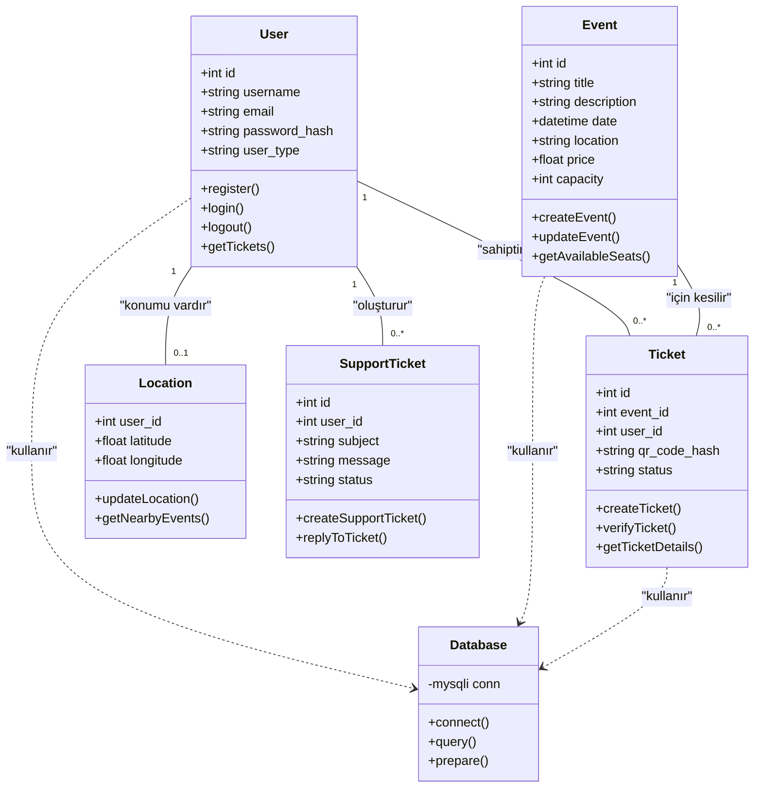

### 3.7. Veri Modeli

#### 3.7.1. Entity-Relationship Diagram (ERD)
Veritabanı yapısı, tablolar ve aralarındaki ilişkiler aşağıdaki ERD'de gösterilmiştir.

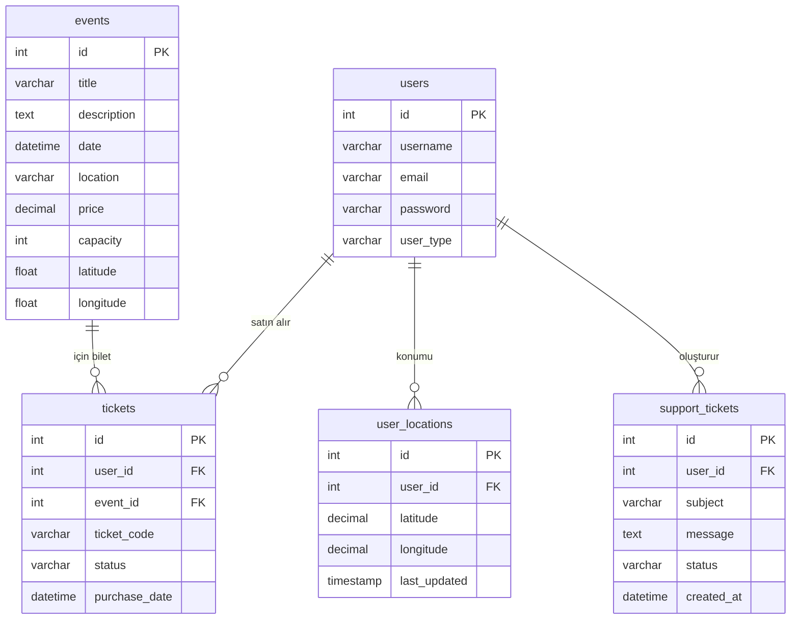

#### 3.7.2. Veri Sözlüğü
- **users:** Kullanıcı bilgilerini saklar. `id` birincil anahtardır.
- **events:** Etkinlik detaylarını tutar. `id` birincil anahtardır. `latitude` ve `longitude` konum tabanlı arama için kullanılır.
- **tickets:** Satılan biletlerin kaydını tutar. `user_id` ve `event_id` ile `users` ve `events` tablolarına bağlıdır.
- **user_locations:** Kullanıcıların konum izni verdiğinde coğrafi bilgilerini saklar.
- **support_tickets:** Kullanıcıların oluşturduğu destek taleplerini saklar.

### 3.8. Arayüz Tanıtımı
- **Ana Sayfa (`index.php`):** Yaklaşan tüm etkinlikleri listeler. Kullanıcı giriş yapmış ve konum izni vermişse, yakınındaki etkinlikler için ayrı bir sekme sunar.
- **Etkinlik Detay (`event.php`):** Seçilen bir etkinliğin tüm detaylarını (tarih, konum, fiyat, açıklama) gösterir ve bilet satın alma seçeneği sunar.
- **Biletlerim (`my_tickets.php`):** Kullanıcının satın aldığı tüm biletleri, detayları ve QR kodlarıyla birlikte listeler.
- **Admin Paneli (`/admin/`):** Yöneticilerin etkinlikleri, kullanıcıları ve biletleri yönetebildiği güvenli bir alandır.

---

## 4. BÖLÜM – TASARIM

### 4.1. Sistem Mimarisi
Sistem, web uygulamaları için yaygın olarak kullanılan **3 Katmanlı Mimari (3-Tier Architecture)** modeline göre tasarlanmıştır.

-   **1. Sunum Katmanı (Presentation Layer):** Kullanıcının doğrudan etkileşimde bulunduğu katmandır. HTML, CSS ve JavaScript (jQuery, Bootstrap) kullanılarak oluşturulmuştur. Bu katman, kullanıcı arayüzünü oluşturur ve kullanıcıdan gelen girdileri iş mantığı katmanına iletir.
-   **2. İş Mantığı Katmanı (Business Logic Layer):** Uygulamanın beynidir. PHP ile kodlanmıştır. Kullanıcıdan gelen istekleri alır, gerekli hesaplamaları ve işlemleri yapar (örn: bilet satın alma kuralları, kontenjan kontrolü) ve veri katmanıyla iletişim kurar. `login.php`, `event.php`, `update_location.php` gibi dosyalar bu katmanda yer alır.
-   **3. Veri Erişim Katmanı (Data Access Layer):** Verilerin depolandığı ve yönetildiği katmandır. MySQL veritabanı ve bu veritabanıyla iletişimi sağlayan PHP (MySQLi) kodlarından oluşur. `includes/config.php` ve `includes/functions.php` içindeki veritabanı fonksiyonları bu katmanın bir parçasıdır.

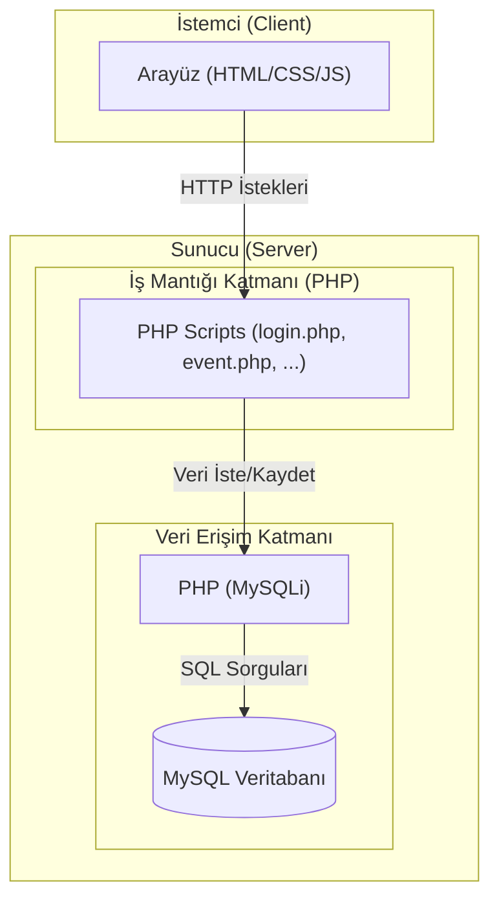

### 4.2. UML Diyagramları

#### Aktivite Diyagramı (Bilet Satın Alma)
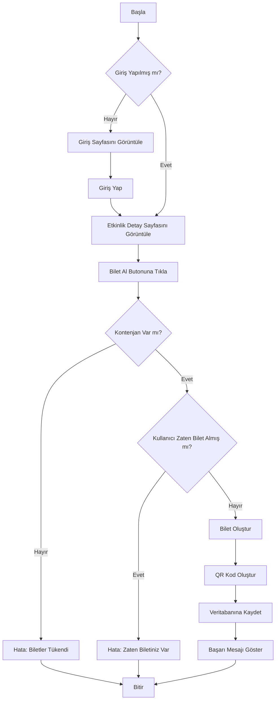

#### Durum Diyagramı (Bilet Nesnesi)
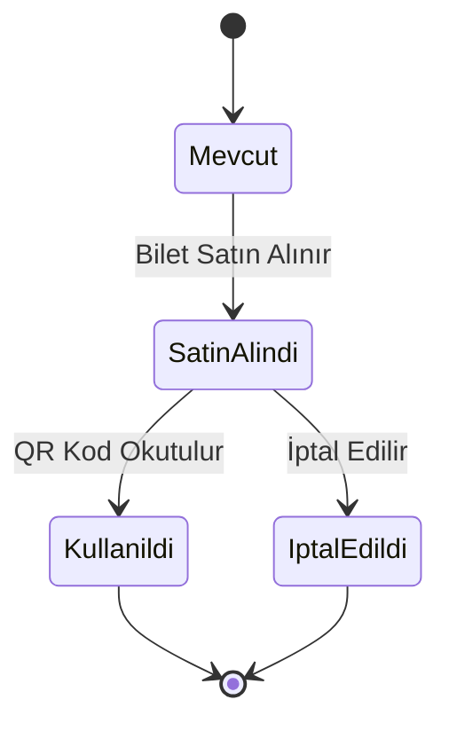

#### Sıralama Diyagramı (Yakındaki Etkinlikleri Gösterme)
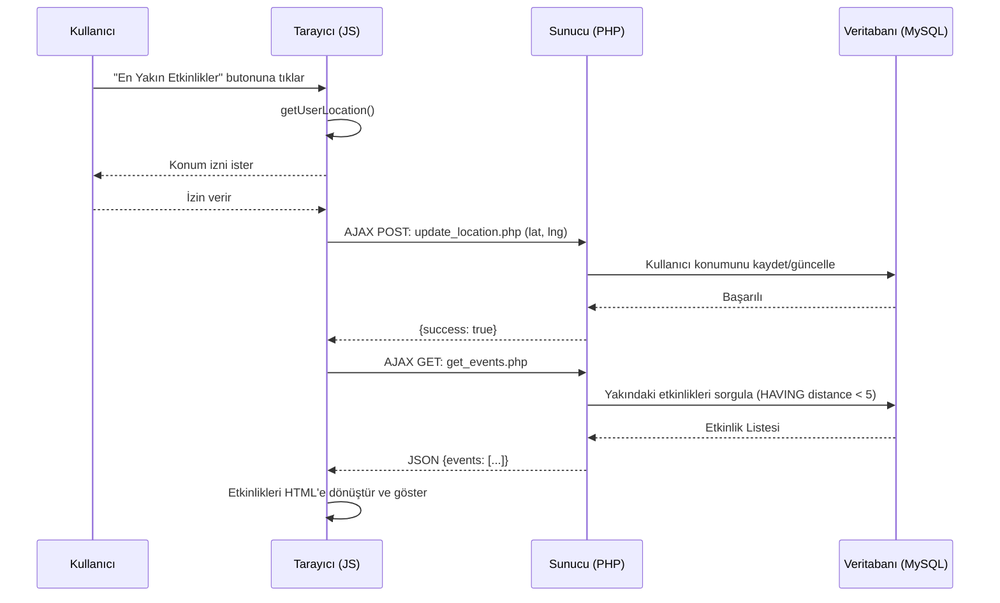

#### Bileşen Diyagramı
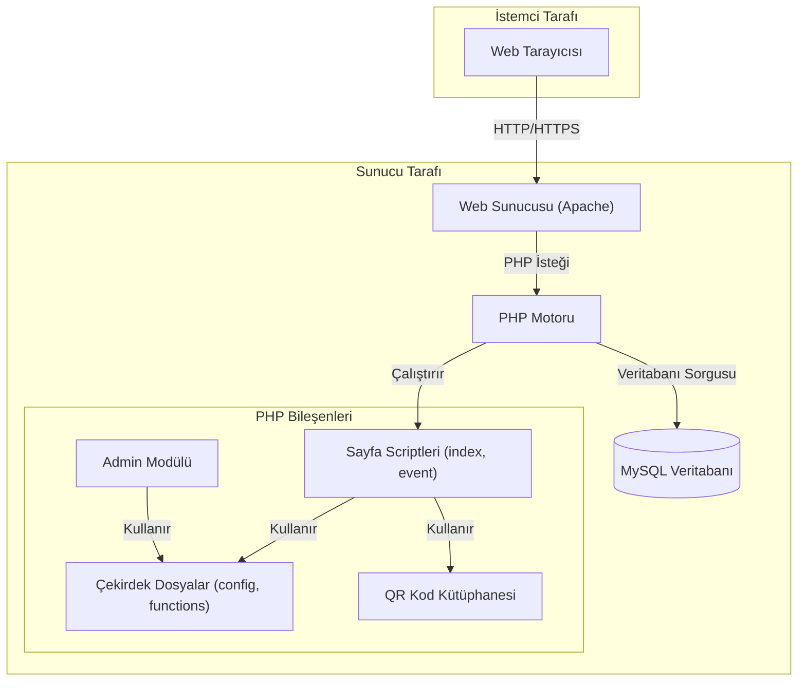

#### Deployment Diyagramı
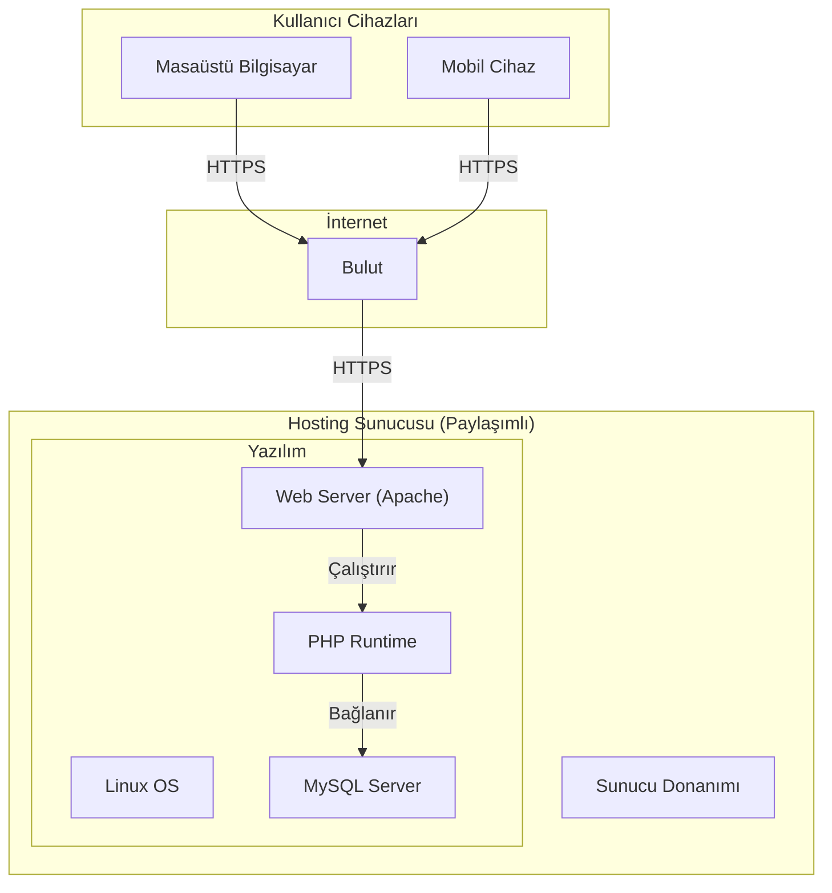

### 4.3. Diğer Diyagramlar

#### Rich Picture (Zengin Görsel Gösterim) - Metinsel Açıklama
Zengin resim, sistemin paydaşlarını ve aralarındaki karmaşık ilişkileri basit bir çizimle anlatır. Bizim sistemimiz için bu resim şöyle olurdu:
-   **Merkezde:** "Etkinlik Bilet Sistemi" adında bir bulut veya sunucu çizimi.
-   **Solda:** Farklı cihazlar (laptop, telefon) kullanan mutlu "Kullanıcılar". Kullanıcılar sisteme para gönderir (bilet alımı) ve sistemden QR kodlu biletler alırlar. Bir kullanıcı, konum simgesiyle "Yakınımda ne var?" diye düşünür.
-   **Sağda:** Bilgisayar başında oturan bir "Yönetici". Yönetici, sisteme yeni etkinlik bilgileri girer ve sistemden satış raporları alır.
-   **Altta:** Bir etkinlik alanı (konser, tiyatro). Girişte bir görevli, elindeki QR kod okuyucu ile kullanıcıların biletlerini kontrol eder.
-   **Arka Planda:** Bankalar (ödeme altyapısı için), sosyal medya (etkinlik paylaşımı için) gibi dış etkenler bulunur. Bu resim, sistemin sadece teknik değil, sosyal ve ekonomik bağlamını da gösterir.

#### Context Diagram (Bağlam Diyagramı - DFD Seviye 0)
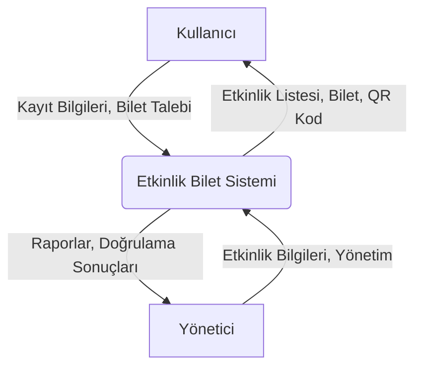

---

## 5. BÖLÜM – GERÇEKLEŞTİRME

### 5.1. Kullanılan Teknolojiler ve Araçlar
-   **Backend (Sunucu Tarafı):** PHP (v7.4+). Prosedürel ve nesneye yönelik programlama paradigmaları bir arada kullanılmıştır. Güvenlik için `prepared statements` tercih edilmiştir.
-   **Frontend (İstemci Tarafı):** HTML5, CSS3, JavaScript. Kullanıcı arayüzü ve etkileşim için Bootstrap 5 framework'ü ve jQuery kütüphanesi kullanılmıştır.
-   **Veritabanı:** MySQL (MariaDB uyumlu). İlişkisel veritabanı yönetim sistemi olarak tercih edilmiştir.
-   **QR Kod:** `php-qrcode` kütüphanesi kullanılarak sunucu tarafında dinamik olarak QR kodlar üretilmiştir.
-   **Geliştirme Ortamı:** Visual Studio Code, XAMPP (Apache, MySQL, PHP).

**Seçim Nedenleri:** Bu teknolojiler, paylaşımlı hosting ortamlarında yaygın olarak desteklenmesi, geniş bir topluluğa ve dokümantasyona sahip olması, öğrenme eğrisinin düşük olması ve projenin gereksinimlerini tam olarak karşılaması nedeniyle tercih edilmiştir.

### 5.2. Veritabanı Mimarisi
Veritabanı, 3.5. bölümde ERD'si verilen normalleştirilmiş (3NF'ye yakın) bir yapıya sahiptir.
-   **Tablolar Arası İlişkiler:** `Foreign Key` (Yabancı Anahtar) kısıtlamaları ile veri bütünlüğü sağlanmıştır. Örneğin, `tickets` tablosundaki `user_id` silinmiş bir kullanıcıyı işaret edemez.
-   **İndeksleme:** `id` (PK) ve `user_id`, `event_id` (FK) gibi sık sorgulanan sütunlar üzerinde otomatik olarak veya manuel olarak indeksler oluşturularak sorgu performansı artırılmıştır.

### 5.3. Kodlama Standartları
-   **İsimlendirme:** Değişkenler ve fonksiyonlar için `snake_case` (örn: `$user_id`, `get_all_events()`), sınıflar için `PascalCase` (örn: `User`) kullanılmıştır.
-   **Yorumlama:** Kodun kritik bölümleri, fonksiyonların amaçları ve karmaşık algoritmalar için Türkçe yorum satırları eklenmiştir.
-   **Güvenlik:** SQL enjeksiyonunu önlemek için tüm veritabanı sorgularında `mysqli prepared statements` kullanılmıştır. Kullanıcıdan alınan veriler (`htmlspecialchars`) filtrelenerek XSS zafiyetlerinin önüne geçilmiştir.

---

## 6. BÖLÜM – TEST
Proje boyunca sürekli ve aşamalı bir test yaklaşımı benimsenmiştir.

-   **Birim Test (Unit Testing):** Fonksiyonlar ve metotlar ayrı ayrı test edilmiştir. Örneğin, `formatDate()` fonksiyonunun farklı tarih formatlarını doğru çevirip çevirmediği kontrol edilmiştir.
-   **Entegrasyon Testi (Integration Testing):** Modüllerin bir arada çalışma durumu test edilmiştir. Örneğin, kullanıcı giriş yaptıktan sonra konumunu güncelleyip ardından yakınındaki etkinlikleri başarıyla listeleyebilmesi test edilmiştir.
-   **Kullanıcı Kabul Testi (User Acceptance Testing):** Geliştirici, son kullanıcı ve yönetici rollerini üstlenerek tüm senaryoları (bilet alma, bilet doğrulama vb.) baştan sona test etmiştir.

---

## 7. BÖLÜM – BAKIM

### 7.1. Kurulum ve Entegrasyon
Sistemin kurulumu oldukça basittir:
1.  Proje dosyaları web sunucusuna (örn: `/public_html/`) kopyalanır.
2.  `includes/config.php` dosyası açılarak veritabanı bağlantı bilgileri (`DB_HOST`, `DB_USER`, `DB_PASS`, `DB_NAME`) ve ana URL (`BASE_URL`) düzenlenir.
3.  Bir veritabanı oluşturulur ve `db_setup.php` script'i tarayıcı üzerinden bir kez çalıştırılarak gerekli tabloların ve örnek verilerin oluşturulması sağlanır.
4.  Kurulum sonrası güvenlik için `db_setup.php` dosyası sunucudan silinmelidir.

---

## 8. BÖLÜM – SONUÇ

### 8.1. Projenin Değerlendirilmesi
Bu proje ile hedeflenen fonksiyonel ve fonksiyonel olmayan gereksinimlerin tamamı başarıyla karşılanmıştır. Ortaya çıkan uygulama, hem son kullanıcılar hem de yöneticiler için işlevsel, güvenli ve kullanımı kolay bir etkinlik biletleme platformudur. Özellikle konum tabanlı servislerin entegrasyonu, sistemi standart biletleme sitelerinden ayırarak önemli bir katma değer sağlamıştır.

### 8.2. Benzer Sistemlerle Karşılaştırma
| Özellik | Bizim Sistemimiz | Biletix / Passo | Küçük Etkinlik Siteleri |
| :--- | :---: | :---: | :---: |
| **Konum Tabanlı Öneri** | ✅ | ❌ | ❌ |
| **Düşük Maliyet (Shared Hosting)**| ✅ | ❌ | ✅ |
| **Kolay Kurulum ve Yönetim**| ✅ | ❌ | ⚠️ (Değişken) |
| **Anında QR Kod ile Bilet** | ✅ | ✅ | ⚠️ (Değişken) |
| **Açık Kaynak Kodlu** | ✅ | ❌ | ❌ |

### 8.3. Gelecek Geliştirmeleri
Sistemin mevcut yapısı üzerine aşağıdaki geliştirmeler eklenebilir:
-   **Ödeme Entegrasyonu:** Sanal POS entegrasyonu (Iyzico, PayTR) ile gerçek ödeme altyapısı kurulabilir.
-   **Etkinlik Düzenleyici Rolü:** Yöneticiden farklı olarak, sadece kendi etkinliklerini yönetebilen "Etkinlik Sahibi" rolü eklenebilir.
-   **Mobil Uygulama:** Sistemin API'ları geliştirilerek iOS ve Android için hibrit veya native bir mobil uygulama yazılabilir.
-   **Detaylı Raporlama:** Yöneticiler için daha gelişmiş grafiksel raporlar ve istatistikler sunulabilir.
-   **Sosyal Medya Entegrasyonu:** Etkinliklerin ve biletlerin sosyal medyada kolayca paylaşılması sağlanabilir.

---

## 9. BÖLÜM – KAYNAKLAR
-   PHP Resmi Dokümantasyonu: [https://www.php.net/manual/tr/](https://www.php.net/manual/tr/)
-   MySQLi Dokümantasyonu: [https://www.php.net/manual/tr/book.mysqli.php](https://www.php.net/manual/tr/book.mysqli.php)
-   Bootstrap 5 Dokümantasyonu: [https://getbootstrap.com/docs/5.0/](https://getbootstrap.com/docs/5.0/)
-   jQuery API Dokümantasyonu: [https://api.jquery.com/](https://api.jquery.com/)
-   Mermaid.js Diyagram Dokümantasyonu: [https://mermaid-js.github.io/mermaid/](https://mermaid-js.github.io/mermaid/)
-   Yazılım Mühendisliği Ders Notları ve Prensipleri. 
