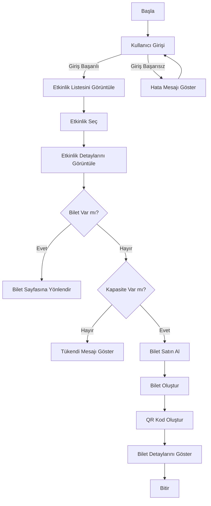
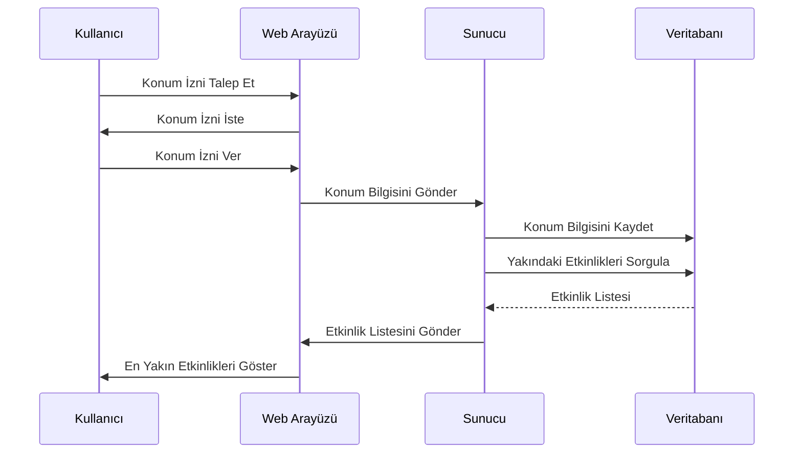
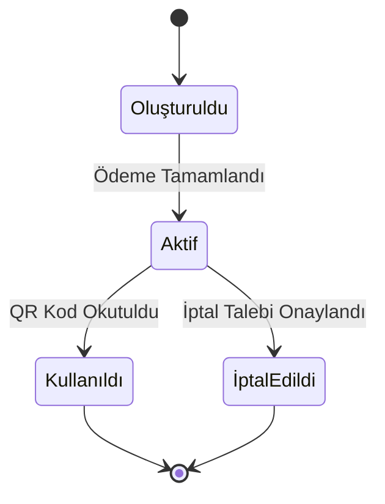
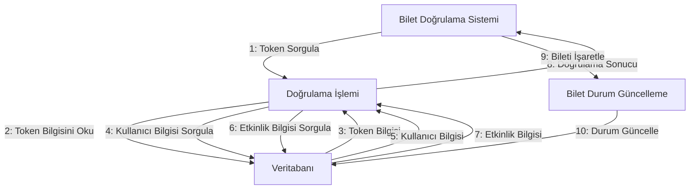
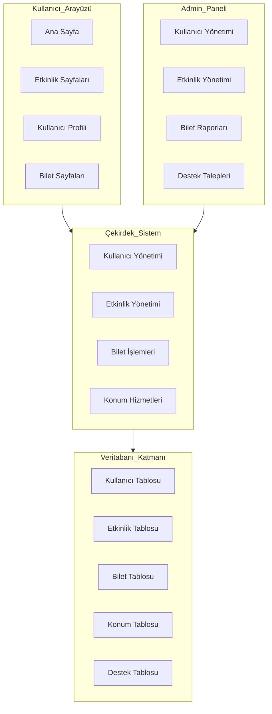
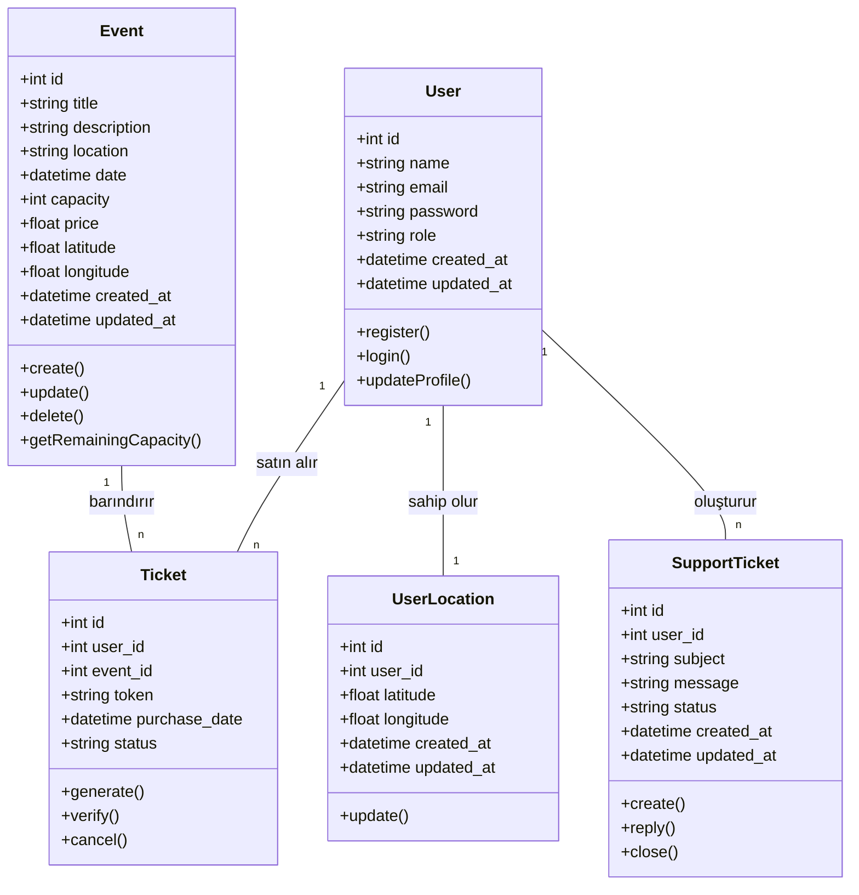

# Bilet Sistemi Projesi UML Diyagramları

## Proje Adı: Bilet Sistemi
## Grup Üyesi: [Adınızı ve Öğrenci Numaranızı Buraya Yazın]

## 1. Activity Diyagramı (Bilet Satın Alma Süreci)

## 2. Sequence Diyagramı (Konum Tabanlı Etkinlik Önerisi)

## 3. State (Durum) Diyagramı (Bilet Durumları)

## 4. Collaboration Diyagramı (Bilet Doğrulama)

## 5. Package (Paket) Diyagramı (Sistem Mimarisi)

# Sınıf Diyagramı (Bonus)

